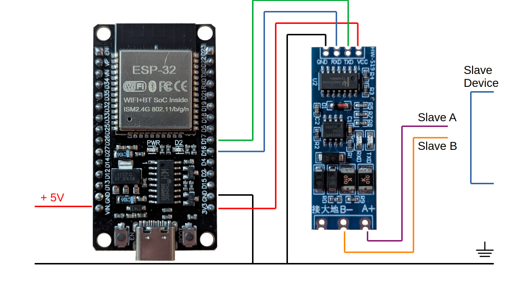

# wp-modbus-mqtt

This project provides a bridge between Modbus devices and MQTT, specifically designed for integration with heat pumps. It is compatible with both ESP32 and ESP8266 microcontrollers, allowing flexible deployment on popular IoT hardware.

**Hardware Requirement:**  
To connect to Modbus devices, you will need an RS485 TTL bridge.

**License Notice:**  
Some minor parts of the code are based on [gmasse/esp-modbus-mqtt](https://github.com/gmasse/esp-modbus-mqtt), which is licensed under GPL 3. As a result, this project is currently also distributed under the GPL 3 license. Once all third-party code is replaced with original implementations, the project will be relicensed under a more permissive terms (MIT/Apache 2).

## Wiring

> [!WARNING]  
> Never connect your Boards via USB while the external Power over the VIN PIN is connected. This will very surely destroy the board.

In this project we're using the pins D16 and D17 on an ESP32 DevKit Board as the second hardware serial port to communicate with the RS485 / TLL bridge. The ports can be adjusted in `src/modbus_base.h`

In a later Version I might put this into the Wifi Manager to make it configurable at runtime.

```cpp
#if defined(ARDUINO_ARCH_ESP32)
#define RXD 16 // aka D16
#define TXD 17 // aka D17
#elif defined(ARDUINO_ARCH_ESP8266)
#define RXD 14 // aka D5
#define TXD 12 // aka D6
#endif
#define RTS NOT_A_PIN
```
For the ESP8266 based D1 mini board there's no second serial port, so the software serial is used. I tested it briefly and it seems to work at least on 9600 baud.



### Deployment
I used Visual Studio Code with the *platformio* Extension to deploy this to my boards over USB. I think this is the easiest way:

https://docs.platformio.org/en/latest/integration/ide/vscode.html#installation

### Configuring

After deploying your code onto the Board the first time it will open a WIFI network which you need to connect to with your Computer.

---

Network SSID: `AutoConnectAP`
Network password: `password`

---

Here you have the options to configure your WiFi the board should connect to, as well as the following settings:
- MQTT host
- MQTT port
- MQTT base topic

### Configuring relevant registers

The registers are configured at compile time. In a later version I might move it to the WifiManager, but for now ou need to adjust the `registers` array in `modbus_registers.h`:

```cpp
const modbus_register_t registers[] = {
	{93, MODBUS_TYPE_HOLDING, REGISTER_TYPE_U16, "ein_aus"},
	{94, MODBUS_TYPE_HOLDING, REGISTER_TYPE_U16, "modus"},
	{51, MODBUS_TYPE_HOLDING, REGISTER_TYPE_U16, "temp_akt"},
	{107, MODBUS_TYPE_HOLDING, REGISTER_TYPE_U16, "temp_soll_kuehl"},
	{106, MODBUS_TYPE_HOLDING, REGISTER_TYPE_U16, "temp_soll_heiz"},
	{109, MODBUS_TYPE_HOLDING, REGISTER_TYPE_U16, "temp_soll_auto"}
};
```

### Configuring Address and Baus Rate

in `modbus_base.h` you can set the Modbus SalveID and the Modbus Baud Rate:

```cpp
#define MODBUS_BAUDRATE 9600
#define MODBUS_UNIT 1
```

### Reading and writing MODBUS data

Based on the mac address of the chip a unique "hostname" is creted which is appended to the base topic configured in the wifi Manager.

Example: If you configured the topic esp/modbus then the following topics are relevant:

`esp/modbus/[hostname]/data`
`esp/modbus/[hostname]/status`
`esp/modbus/[hostname]/action/write_register`

from the `data` topic you can get the actual state of the slave, by reading the configured registers in a json format. Example document:

```json
{
  "ein_aus": 0,
  "modus": 0,
  "temp_akt": 0,
  "temp_soll_kuehl": 0,
  "temp_soll_heiz": 0,
  "temp_soll_auto": 0
}
```

from the `status` document you can get the uptime and free memory. example document:

```json
{
  "freeHeap": 229888,
  "uptime": 1563,
  "time": "2025-9-24 18:51:14"
}
```

to set a value for a given register, write a message to the `action/write_register` topic in the format 

```
[register_name]=[new_value]
```
Example:
```
temp_soll_heiz=22
```

If the slave accepts it, it will reflect in the data document ithin the next polling interval (usually 2 seconds)